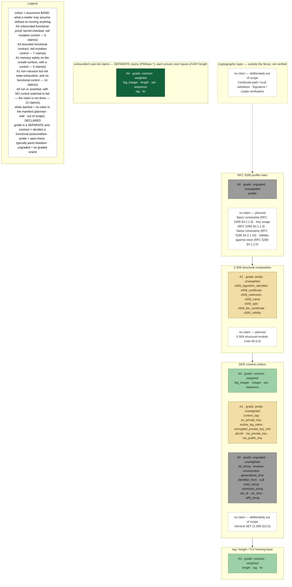

# der-verified

[](https://crates.io/crates/der-verified)
[](https://docs.rs/der-verified)
[](#license)

A DER (X.690) encoding/decoding core in Rust **under formal verification**, with re-runnable
evidence and an explicit claim-by-claim assurance map.

**Status:** pre-1.0 (`0.1.1`). Today **13 of 39** manifest claims reach the target assurance band A3
or better; **26 do not** (14 are A1 and 12 are A0). The crate is therefore not uniformly formally
verified and is not done. Proofs are bounded except for the selected Lean properties below; the API
is unstable, with no production deployment record. Evaluate it as a building block, not a hardened parser.

## Evidence at a glance

- **L3 — Kani:** 203 proof harnesses over 33 modules establish default safety checks on their
  bounded domains; functional claims vary by harness and are listed in the proof manifest.
- **L4/L5 — Aeneas → Lean 4:** selected properties of six codecs (`length`, `big_integer`, `oid`,
  `tag`, `tlv`, `sequence`) hold for any input length; `sequence` also covers any child count. The
  lids are `sorry`-free; `tag` canonicality rejection remains Kani-bounded at 7 bytes.
- **Tests:** 485 unit and regression tests plus 34 doc-tests cover concrete vectors. Counts are
  inventory, not coverage.

Read [`PROOF_MANIFEST.md`](PROOF_MANIFEST.md) for the exact properties, bounds, stubs and non-goals;
[`ASSUMPTIONS.md`](ASSUMPTIONS.md) for the trusted base; and generated
[`acceptance.toml`](der-verified/acceptance.toml) for every claim's evidence, grade and weight. The
manifest and [records](der-verified/evidence/acceptance-records/) ship in the crate; the
[crate README](der-verified/README.md) explains what remains repository-only.

## Scope

- **Core codecs:** tag, definite length, TLV framing, primitive content codecs, `SEQUENCE`, and
  `SET OF` member ordering. Read “primitive” strictly: properties and bounds differ by codec.
- **Structural containers:** `x509_*` and the signature/private-key containers compose the core.
  Their evidence is bounded framing, not algorithm, key, signature, or certificate semantics.
- **Profile:** three value-level RFC 5280 cross-field rules are covered; this is not full profile or
  path validation.
- **Out of scope:** cryptographic verification, trust/path validation, remaining RFC 5280 profile
  rules, and general `SET` (§10.3). See [`DECISIONS.md`](DECISIONS.md), `PROOF_MANIFEST.md` §6, and
  the module docs.

Two composition bounds are especially important: `x509_certificate` proves panic-freedom only
through 12 bytes versus a roughly 170-byte fixture, and `rsa_private_key` only through 20 bytes
versus a roughly 317-byte fixture. Beyond those bounds, confidence rests on an un-machine-checked
compositional argument plus concrete witnesses, not a symbolic proof over real-size inputs. See
`PROOF_MANIFEST.md` §6.2.

> **Framing is not validity.** `tlv::decode_tlv`, its strict sibling, and the `sequence` child walk
> accept structurally framed values without deciding whether the identifier is legal for DER; this
> includes constructed encodings of primitive-only universal types and reserved EOC. Typed TLV
> parsers (`octet_string`, `pkcs8`, the `x509_*` modules) check their own identifiers; content-level
> codecs never see one. `identifier_form` adds opt-in form-checking, but it is not wired into the base
> TLV or sequence APIs. See `PROOF_MANIFEST.md` §6.3.

## Verification map

This generated map grades evidence, not tools. Above A0 requires an observed-red control; grade is a
separate axis (`contract`, `probe`, or `ungraded`). The map is per module; use
[`COVERAGE.md`](COVERAGE.md) when the question is whether a particular DER or RFC 5280 rule is
decided. White dashed boxes are declared non-claims.

<!-- BEGIN GENERATED:map (gates/gen_verification_map.py) -->
**Colour is the assurance BAND, not the tool.** Target: band **A3** or better on every claim. Today **13 of 39** claims reach A3 or better, and **26** do not — so this crate is not done, and the picture is drawn to show that rather than to hide it.



Bands, grades and claim ids come from [`der-verified/acceptance.toml`](der-verified/acceptance.toml) — the generated acceptance/0 manifest for subject commit `402719a`, generated `2026-09-04T23:08:58Z`. A band above A0 needs a control that was watched to fail, so nothing here can be raised by adding harnesses alone.
<!-- END GENERATED:map -->

## Strict decoding

Top-level strict entry points reject trailing bytes. `tlv::decode_tlv_strict` and
`sequence::decode_sequence_tlv_strict` require exactly one value; composable variants leave a suffix
only so containers can parse children. Kani checks strict rejection on its bounded domain, while the
TLV consumption/no-over-read property also has an unbounded Lean lid. This does not turn the base
framing APIs into DER-validity checks; the identifier-form residual above still applies.

## Use

```sh
cargo add der-verified
```

```rust
use der_verified::length::decode_length;
use der_verified::x509_certificate::parse_certificate;

let (length_value, consumed) = decode_length(&bytes)?; // canonical length field
let cert = parse_certificate(der_bytes)?;              // strict structural framing; no crypto
```

The crate has zero runtime dependencies, is `#![forbid(unsafe_code)]`, and is allocation-free on the
decode paths. It is not `#![no_std]` today.

## Security considerations

- **Bounded means bounded.** A Kani result covers only its harness's buffer and unwind domain; the
  selected Lean properties are the stated exceptions. Deep nesting and resource exhaustion are not
  proven away, and the crate imposes no recursion-depth or total-work limit of its own. Bound
  untrusted input size and nesting depth; a Rust stack overflow aborts the process.
- **No cryptography or trust decision.** A structurally parsed object is not thereby a valid
  certificate, key, or signature.
- **The trusted base is real.** Claims depend on Kani/CBMC/SAT, the Lean kernel, pinned toolchains,
  and Aeneas extraction fidelity: the lids prove a model of the Rust. Their 13 declared axioms
  specify upstream `core` primitives, not crate code. The proof manifest also names three
  known-unsatisfiable covers and their separate witnesses. See [`ASSUMPTIONS.md`](ASSUMPTIONS.md).

For vulnerability reporting, see [`SECURITY.md`](SECURITY.md).

## Verify it yourself (the point of this crate)

The evidence is re-runnable. From a fresh clone:

### Laptop replay

```sh
./replay.sh
./replay.sh --with-lean
```

The default replays tests, the acceptance gate, one Kani harness, and negative controls; it validates
recorded Lean evidence but does not run Lean. `--with-lean` re-extracts and checks the lids, but is
**accept-only** — it confirms the lids hold; the recorded Lean mutation controls are validated as
records, not re-run. Neither mode runs the full Kani floor or establishes X.509 correctness; read
[`REPLAY.md`](REPLAY.md).

### Tests and full gates

```sh
cargo test                                      # 485 tests + 34 doc-tests
cargo install --locked kani-verifier --version 0.67.0
cargo kani setup
cargo kani -Z stubbing                          # 203 proof harnesses, needs a large machine
```

```sh
./check_fast.sh     # docs/manifests + tests
./check.sh          # full Kani floor; Lean runs only when its pinned toolchain is present
```

`-Z stubbing` is required for the eight modular harnesses; their independently discharged contracts
are listed in `PROOF_MANIFEST.md` §8.4. The Lean step re-extracts the shipped Rust, fails on drift or
`sorry`, and requires the exact Aeneas/Charon/Lean pins below.

## Toolchain pins

| Tool | Version | Source of truth |
|---|---|---|
| rustc | floating `stable` channel | `rust-toolchain.toml` |
| Kani | `0.67.0` (pinned in CI; bundles CBMC) | `.github/workflows/ci.yml` |
| Lean 4 | `v4.30.0-rc2` | `lean/lean-toolchain` |
| Aeneas / Charon | pinned commits | `lean/check_lean.sh` |

## Continuous integration

[GitHub Actions](.github/workflows/ci.yml) runs hygiene and parity gates, tests, clippy, and the
memory-tractable **175 of 203** Kani harnesses. The remaining heavy modules are a local milestone via
`./check.sh`; the full floor needs roughly 24 GB available (largest harness peaks ~20 GB). Indicative shard timings and
memory measurements live in [`docs/verification-cost.md`](docs/verification-cost.md).

The `x509_name` proof's split from a monolithic >100 GB attempt into discharged modular proofs is
explained in [`docs/why-verified.md`](docs/why-verified.md#a-war-story-the-proof-that-needed-100-gb).

## Documentation

- [`docs/why-verified.md`](docs/why-verified.md) — why a verified DER decoder, the two-layer
  (Kani + Aeneas→Lean) approach, the honesty envelope, and the modular-proof war story.
- [`COVERAGE.md`](COVERAGE.md) — the per-rule coverage ledger: one row per X.690 / RFC 5280 rule,
  its evidence strength, and a self-verify command per row. Start here if your question is "is *this
  rule* verified?" rather than "does *this module* have harnesses?".
- [`PROOF_MANIFEST.md`](PROOF_MANIFEST.md) — what is proven, bounds, assumptions, stubs, and non-goals.
- [`DECISIONS.md`](DECISIONS.md) — the contestable-decisions ledger: every scope narrowing and design
  fork, with its rationale and review outcome.
- [`SECURITY.md`](SECURITY.md) — private vulnerability disclosure.
- [`DOCS-SYNC.md`](DOCS-SYNC.md) — which documents to update when code or proofs change.

## License

Dual-licensed under either of

- Apache License, Version 2.0 ([LICENSE-APACHE](LICENSE-APACHE))
- MIT license ([LICENSE-MIT](LICENSE-MIT))

at your option. Unless you explicitly state otherwise, any contribution intentionally submitted for
inclusion in the work by you, as defined in the Apache-2.0 license, shall be dual-licensed as above,
without any additional terms or conditions.
