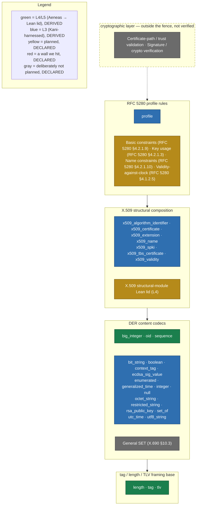

# der-verified

[](https://crates.io/crates/der-verified)
[](https://docs.rs/der-verified)
[](#license)

A **formally verified** DER (X.690) encoding/decoding core in Rust — the encoding layer where real
X.509 parser differentials live. Every public codec carries machine-checkable evidence, and that
evidence is **re-runnable from a fresh clone**: the proofs are the product, not a badge.

- **L3 — Kani** (bounded model checking): 177 proof harnesses over 28 modules — memory safety, no
  panics, no overflow, plus the functional properties (round-trip, canonicality/minimality, rejection
  of malformed/non-canonical encodings).
- **L4/L5 — Aeneas → Lean 4** (unbounded proofs): six codecs (`length`, `big_integer`, `oid`,
  `tag`, `tlv`, `sequence`) are additionally proven over inputs of **any length** — and, for `sequence`,
  ALSO **any number of children** (the crate's first unbounded-loop lid) — `sorry`-free.
- **369** unit and regression tests (concrete vectors, incl. seeded-bad specimens) alongside the proofs.

> **Read [`PROOF_MANIFEST.md`](PROOF_MANIFEST.md) before relying on any of this.** It is the honest
> proof envelope: exactly what is proven, under what bounds and assumptions, what is stubbed, and
> **what is *not* proven**. Counts are inventory, not a coverage guarantee.

## Scope — proven vs. tested vs. out of scope

**In scope (verified):** the DER encoding layer — identifier (tag) and definite-length fields, and
the canonical content codecs: `BOOLEAN`, `INTEGER` (`i64` and arbitrary-magnitude), `NULL`,
`OBJECT IDENTIFIER`, `BIT STRING`, `OCTET STRING`, `ENUMERATED`, the ASCII-restricted strings,
`UTF8String`, `UTCTime`, `GeneralizedTime`, `SEQUENCE`, and `SET OF` member-ordering (§11.6).

**Structural composition (framing only, no semantics):** the `x509_*` modules parse RFC 5280 objects
(`AlgorithmIdentifier`, `SubjectPublicKeyInfo`, `Name`, `Validity`, `Extension`/`Extensions`,
`TBSCertificate`, `Certificate`) by composing the verified codecs. They interpret **no**
algorithm/key/signature/certificate semantics — a demonstration that the verified core is usable
downstream, inside the same fence.

**Signature-container framing (Kani-proven, no Lean lid):** the [`ecdsa_sig_value`] module parses the
ASN.1 `ECDSA-Sig-Value` (RFC 3279 §2.2.3 / RFC 5480) — `SEQUENCE { r INTEGER, s INTEGER }` — composing
`sequence` + `big_integer`. `r`/`s` are exposed as opaque validated bytes, never materialized as
numbers. DER framing and canonicality only: **no** curve-order range check (`1 <= r,s <= n-1` needs a
curve, which this container does not carry), **no** low-S policy (a protocol profile choice, not a DER
validity rule), and **no** cryptographic interpretation — see the module doc for the full fence.

**Key-container framing (Kani-proven, no Lean lid):** the [`rsa_public_key`] module parses the
PKCS#1 `RSAPublicKey` (RFC 8017 §A.1.1) — `SEQUENCE { modulus INTEGER, publicExponent INTEGER }` —
structurally the same two-INTEGER container shape as [`ecdsa_sig_value`], composing `sequence` +
`big_integer`. `modulus`/`publicExponent` are exposed as opaque validated bytes, never materialized
as numbers. This is the container that sits inside an SPKI's BIT STRING payload for an
`rsaEncryption` key; this module parses it wherever it appears — it does **not** unwrap an SPKI
itself. DER framing and canonicality only: **no** exponent oddness/minimum-value policy, **no**
modulus size policy, and **no** RSA semantics whatsoever — see the module doc for the full fence.

**Typed profile-validation layer (Kani-proven, no Lean lid):** the [`profile`] module is a first
slice of a layer built *on top of* the structural parsers above, checking cross-field RFC 5280 rules
those parsers deliberately leave to the caller. It currently enforces three rules: §4.1.1.2's
`signatureAlgorithm == tbsCertificate.signature` equality, §4.1.2.1/§4.1.2.9's "extensions is
v3-only" rule, and §4.1.2.5's UTCTime-through-2049/GeneralizedTime-from-2050 encoding-choice rule.
Each of the three is proven as a **biconditional** — the rule fires *exactly* when it should — and the
documented precedence between them is proven too, over symbolic field values rather than symbolic DER
bytes (which is why the module is the cheapest in the crate to verify: ~0.5 s, ~205 MB). No Lean lid.
Not yet covered: name constraints, key usage, basic constraints, path validation, and any other
RFC 5280 cross-field rule — see [`PROOF_MANIFEST.md`](PROOF_MANIFEST.md) for the honest framing.

**Out of scope (not implemented, not proven):** signature/crypto verification; certificate-path or
trust validation; full X.509/RFC 5280 profile semantics beyond the three `profile`-module rules above
(name constraints, key usage, basic constraints, validity-against-clock, path validation); general
`SET` (§10.3). The crate is a strict, deliberately narrowed profile — the narrowings (e.g.
leap-second rejection, range caps, primitive-form-only rules) are design decisions recorded in
[`DECISIONS.md`](DECISIONS.md).

## Verification map

A picture of the same scope section above, coloured by evidence grade and regenerated from
source on every check — a hand-drawn version of this diagram is exactly the kind of claim that
rots the moment coverage changes, so there isn't one.

**Green and blue are derived from gated sources** — green from the Aeneas → Lean lid set (the
same derivation `PROOF_MANIFEST.md`'s L4 table uses), blue from every other harnessed module in
[`gates/tiers.txt`](gates/tiers.txt), itself enforced against the source tree by
[`gates/check_tier_parity.py`](gates/check_tier_parity.py). **Yellow, red and gray are human
judgements**, not derived from code — each one is a row in
[`gates/map_declared.txt`](gates/map_declared.txt) citing the file and section it is read from.
That split is load-bearing, not decorative: an undisclosed gated-looking claim on this repo's
front page is exactly the wrong shape.

<!-- BEGIN GENERATED:map (gates/gen_verification_map.py) -->

<!-- END GENERATED:map -->

## Strict decoding — exact consumption, no trailing bytes

X.690 §8.1.1.1 requires a DER value to be *exactly one* complete TLV with no trailing data. This crate
makes that explicit at the API boundary: the top-level entry points are **strict** and fail closed on
any trailing byte.

- `tlv::decode_tlv_strict` and `sequence::decode_sequence_tlv_strict` require the input to be exactly
  one TLV / one SEQUENCE and return a distinct `TrailingData` error otherwise;
  `x509_certificate::parse_certificate` uses the strict form, so appended bytes are rejected at the
  outer SEQUENCE. The non-strict `decode_tlv` / `decode_sequence_tlv` exist only to drive recursive
  parsing of *inner* values — where consuming one TLV and leaving a suffix is correct — and are never
  the top-level entry point.
- A Kani harness (`decode_tlv_structure`) proves, over a symbolic buffer, that an accepted TLV consumes
  exactly `header + declared_length` bytes and never over-reads; a second (`strict_rejects_trailing`)
  proves the strict wrapper returns `TrailingData` on a valid TLV followed by an arbitrary trailing
  byte. Both are bounded proofs — see [`PROOF_MANIFEST.md`](PROOF_MANIFEST.md).

Trailing-byte acceptance is a classic parser-differential surface; here it is closed at the top level
and machine-checked on that domain.

## Use

```sh
cargo add der-verified
```

```toml
[dependencies]
der-verified = "0.1.0"
```

(Or pin to the repo as a git dependency:
`der-verified = { git = "https://github.com/ivmat/rs-verified-der" }`.)

```rust
use der_verified::length::decode_length;
use der_verified::x509_certificate::parse_certificate;

// Every decoder is strict: it accepts a byte string only if it is the unique canonical DER encoding.
let (length_value, consumed) = decode_length(&bytes)?;  // rejects non-minimal / non-canonical lengths
let cert = parse_certificate(der_bytes)?;               // structural X.509 framing (no crypto)
```

The crate is `#![forbid(unsafe_code)]` and allocation-free on the decode paths.

## Verify it yourself (the point of this crate)

The evidence is re-runnable. From a fresh clone:

### 1. Tests + the L3 Kani proof floor

```sh
# Rust: the repo pins a stable toolchain via rust-toolchain.toml (rustup selects it automatically).
cargo test                                    # 369 tests + 29 doc-tests

# Kani (bounded model checker) — https://model-checking.github.io/kani/install-guide.html
cargo install --locked kani-verifier            # add `--version 0.67.0` to match the pinned toolchain
cargo kani setup
cargo kani -Z stubbing                          # 177 proof harnesses
```

Or run the whole gate — hygiene checks + tests + Kani + the (guarded) Lean lids:

```sh
./check.sh          # full gate (Kani + Lean run here; minutes; needs ~24 GB RAM — see below)
./check_fast.sh     # fast subset: doc-link gate + proof-manifest gate (+ its self-test) + cargo test
```

Both start with two stdlib-only hygiene gates: doc-link resolution, and a **proof-manifest gate**
(`gates/gen_proof_manifest.py --check`) that re-derives every count in `PROOF_MANIFEST.md` from the
source tree and fails if the document — or a count-claim in this README or in `docs/` — has drifted
from it. Regenerate with `--write`. The gate compares facts derived from the *source tree*, so it
passes on any machine: your rustc version and whether you have Kani or Aeneas installed are recorded
in the manifest as provenance, never gate-enforced (`gates/test_gen_proof_manifest.py` holds that
line, and holds the opposite one too — a drifted count or a drifted declared pin still fails).

**`./check.sh` needs a large machine for the full Kani floor.** Two harnesses peak around 20.5 GiB
and 17.1 GiB, so below roughly 24 GB of available RAM they will not converge and the gate will fail
on memory rather than on any defect. CI runs the memory-tractable share; see
`docs/verification-cost.md` and `PROOF_MANIFEST.md` §3.4.

`-Z stubbing` is required: four X.509 harnesses are **modular** proofs that stub an
independently-proven sub-parser — three never-panics harnesses plus one positive-construction
witness (disclosed, with each stub's discharging harness, in `PROOF_MANIFEST.md` §8.3). Harnesses
without a stub are unaffected by the flag.

### 2. The L4/L5 Lean lids (optional; unbounded proofs on 6 codecs)

`./check.sh` runs the Lean lids if — and only if — the Aeneas/Lean toolchain is present; otherwise it
**skips them and still passes on the Kani floor**. To run them you need, in an isolated location
(default `~/Downloads/verified_rs_tools`, overridable via the `VERIFIED_RS_TOOLS` env var):

- [`elan`](https://github.com/leanprover/elan) (Lean is pinned to `v4.30.0-rc2` by
  `lean/lean-toolchain`, resolved per-directory);
- [Aeneas](https://github.com/AeneasVerif/aeneas) and [Charon](https://github.com/AeneasVerif/charon)
  at the exact commits pinned in `lean/check_lean.sh` (it fails on revision drift, because the proofs
  are checked against a specific Aeneas Std semantics).

The lid **re-extracts each codec from the shipped `.rs`** and fails if the regenerated model differs,
so it provably concerns the shipped source. It also fails closed on any `sorry`.

## Toolchain pins

| Tool | Version | Source of truth |
|---|---|---|
| rustc | `stable` channel (checked at `1.96.1`) | `rust-toolchain.toml` pins the channel |
| Kani | `0.67.0` (pinned in CI; bundles CBMC) | `.github/workflows/ci.yml` |
| Lean 4 | `v4.30.0-rc2` | `lean/lean-toolchain` |
| Aeneas / Charon | pinned commits | `lean/check_lean.sh` |

The crate builds on the current `stable` toolchain; `1.96.1` is the release these claims were last
checked against. For a byte-identical Kani reproduction, install the pinned Kani version (below).

## Continuous integration

[GitHub Actions](.github/workflows/ci.yml) runs, on every push and PR: the two **hygiene gates**
(`gates/check_links.py`, and `gates/gen_proof_manifest.py --check` preceded by its own 18-test
self-test `gates/test_gen_proof_manifest.py`), `cargo test`,
`cargo clippy -D warnings`, and the **memory-tractable share of the Kani proof floor** — currently
**149** of the 177 harnesses (the shard filters are by module, not a pinned count, so this total is
re-derived from the per-module counts rather than maintained by hand; see
`.github/workflows/ci.yml` for the exact per-shard module list), sharded by module across three
parallel runners. The remaining 28 (`set_of`, `sequence`, `x509_certificate`,
`x509_tbs_certificate`, `x509_extension`, `x509_name`) peak above a standard 7 GB runner, so — like
the L4 Lean lids — they are a **local-milestone check** via `./check.sh` (or the `kani-heavy` job
stub in the workflow, on a large-memory runner).

### Measured timing (16-core / 29 GB Linux, Kani 0.67.0)

**All 177 harnesses verify locally with 0 failures.** Approximate Kani solve times (per-shard
harness counts below were re-derived from the current module counts by static count, not a fresh
timing run — treat the *times themselves* as the prior measurement's indicative, possibly-stale
numbers, and the counts as current):

| Stage | Harnesses | Solve time | Peak RAM |
|---|---|---|---|
| `cargo test` + `clippy` (no external deps) | — | ~2 s | — |
| CI shard `codecs-a` | 84 | ~28 s | < 0.2 GB |
| CI shard `codecs-b` | ≈43 | ~40 s | ~1 GB |
| CI shard `utf8` | 9 | ~247 s | 2.7 GB |
| local: `set_of` + `sequence` + `x509_extension` + `x509_certificate` | ≈24 | ~30 min | ~20 GB (`x509_extension`) |
| local: `x509_tbs_certificate` + `x509_name` (`validate_name` stub + `validate_rdn` lemma) | ≈4 | ~9 min | ~17 GB (`validate_rdn`) |

The three CI Kani shards run in parallel (~4–5 min wall). The full local floor is ~40 min of proving;
peak RAM ~20 GB.

**`x509_name` is a modular proof.** A monolithic never-panics proof over `validate_name` is intractable
(>100 GB in CBMC symbolic execution — the SET-OF §11.6 ordering re-derived over symbolic content, before
the SAT solve). It is split: `validate_rdn_never_panics` proves the heavy SET-OF/ATV layer at one-RDN
scale (~17 GB), and `validate_never_panics` stubs `validate_rdn` with its proven postcondition and
verifies the outer-`Name` glue (~510 MB). Same theorem, now compositional; both fit a normal machine.
Each modular stub is discharged over a *symbolic input length*, so it holds at every length the
composition uses. See [`PROOF_MANIFEST.md`](PROOF_MANIFEST.md) and `DECISIONS.md` D26.

## Documentation

- [`docs/why-verified.md`](docs/why-verified.md) — why a verified DER decoder, the two-layer
  (Kani + Aeneas→Lean) approach, the honesty envelope, and the modular-proof war story.
- [`PROOF_MANIFEST.md`](PROOF_MANIFEST.md) — what is proven, bounds, assumptions, stubs, and non-goals.
- [`DECISIONS.md`](DECISIONS.md) — the contestable-decisions ledger: every scope narrowing and design
  fork, with its rationale and review outcome.
- [`SECURITY.md`](SECURITY.md) — private vulnerability disclosure.

## Keeping docs in sync

Every code/proof/feature change ships with a docs-sync pass — see
[`DOCS-SYNC.md`](DOCS-SYNC.md) for exactly which doc(s) to touch for which kind of change (new
harness, new Lean lid, new module/feature, …).

## License

Dual-licensed under either of

- Apache License, Version 2.0 ([LICENSE-APACHE](LICENSE-APACHE))
- MIT license ([LICENSE-MIT](LICENSE-MIT))

at your option. Unless you explicitly state otherwise, any contribution intentionally submitted for
inclusion in the work by you, as defined in the Apache-2.0 license, shall be dual-licensed as above,
without any additional terms or conditions.
